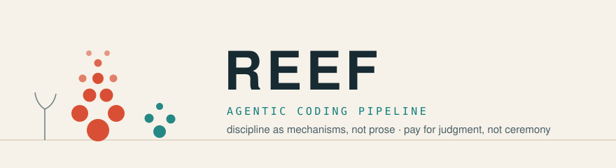

<picture>
  <source media="(prefers-color-scheme: dark)" srcset="assets/banner-dark.svg">
  
</picture>

<p align="center">
  
  
  
  
</p>

# Reef

> *A coral reef grows one calcified layer at a time — each organism leaves a hard structure the next builds on. Reef works the same way: every task, ADR, and glossary line is a fossilized layer that outlives the session that wrote it.*

Token-frugal agentic coding pipeline for Claude Code. Pocock front (grilling, vertical slices, one seam thinking, TDD), Iusztin back (author≠verifier, retry caps, artifacts-as-memory) — thinned, and with the discipline moved from prose into mechanisms.

## Why (design record)
Full multi-agent setups burn tokens on ceremony; pure manual workflows have no safety rails. Reef's red-team-derived rules:
- **Every "hard" rule is code or it doesn't exist.** Retry cap = `scripts/reef-attempt` writing `attempts:` to the task file (survives compaction/restart). Commit gate = git hooks testing the INDEX + CI. Bypass attempts (`--no-verify`, hooksPath edits) are denied by a PreToolUse hook.
- **Author ≠ verifier, enforced.** Fresh-context judge on `design` tasks only; the orchestrator hash-checks the tree around the judge's run. `mech` tasks skip the judge: gate + golden-output test (2 of 4 judge runs in the pilot bought nothing).
- **A finding on a claimed AC = FAIL**, through the cap — never laundered into backlog. The runlog records escaped defects and real usage numbers, never self-reported memory.
- **No failing test = no task.** Slices that can't go red are padding.
- **The human learns**: `design` tasks require the human to write the `## Decision` block themselves before code.

## Install
```
/plugin marketplace add <you>/reef
/plugin install reef@reef
```
Then in your project: `/reef-init` (detects stack, writes .reef/config.json, installs gates — after any fresh clone run `make setup`).

## Who runs what (routing)
| Stage | Runs as | Model / effort | Decided by |
|---|---|---|---|
| Grill / plan / gate | main session | session model | you |
| Implement `mech` (tiny diff) | main session inline | session model | reef-task §2 |
| Implement (normal) | `implementer` agent | printed by `reef-attempt`: attempt 1 = opus medium, after any FAIL = opus high | reef-attempt |
| Verify `mech` | no agent — gate + golden test | free | task frontmatter `verify: gate-only` |
| Verify `design` | `verifier` agent (fresh context) | opus medium | task frontmatter `verify: judge` |
| Review (acceptance/diff) | main session, fresh-context passes | session model | reef-review |
Agent files carry a DEFAULT model (the ladder base) — but the dispatch-time model from `reef-attempt` always overrides it (per-call model > frontmatter). One source of truth for escalation: the script. Effort escalation travels in the dispatch prompt ("reasoning effort: high"), since agent frontmatter has no working effort key (red-team finding #5).

## Flow
`/reef-plan <spec>` → grill → vertical slices → ONE human gate → `/reef-task` (implement→verify→commit per task, mechanical caps) → `/reef-review` (push → PR → acceptance → diff review → CI, rollup tasks under the same caps) → you squash-merge.

## Layout
skills/ (init, plan, task, verify, review) · agents/ (implementer, verifier — no model pins; routing comes from reef-attempt + .reef/config.json) · scripts/ (reef-gate.sh, reef-attempt) · schemas/task.schema.json · templates/

## Acknowledgments
Reef is an original implementation, but its process ideas stand on two open projects:
- [iusztinpaul/squid](https://github.com/iusztinpaul/squid) (Apache-2.0) — the agent-team lifecycle, author/verifier separation, retry-cap concept, artifacts-as-memory.
- [mattpocock/skills](https://github.com/mattpocock/skills) (MIT) — grilling, vertical-slice/tracer-bullet rules (a few planning heuristics in reef-plan closely paraphrase that repo's wording), spec/ticket discipline.
No code was copied from either project. Thanks to Paul Iusztin and Matt Pocock for publishing their work openly.
