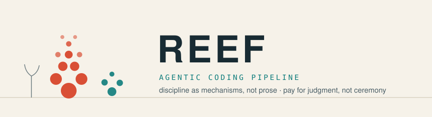

<picture>
  <source media="(prefers-color-scheme: dark)" srcset="assets/banner-dark.svg">
  
</picture>

<p align="center">
  
  
  
  
  
</p>

# Reef

> *A coral reef grows one calcified layer at a time — each organism leaves a hard structure the next builds on. Reef works the same way: every task, ADR, and glossary line is a fossilized layer that outlives the session that wrote it.*

Token-frugal agentic coding pipeline for Claude Code. Pocock front (grilling, vertical slices, one seam thinking, TDD), Iusztin back (author≠verifier, retry caps, artifacts-as-memory) — thinned, and with the discipline moved from prose into mechanisms.

## Why (design record)
Full multi-agent setups burn tokens on ceremony; pure manual workflows have no safety rails. Reef's red-team-derived rules:
- **Every "hard" rule is code, and every gate has a test that shows it going red** (`tests/` — a gate never observed failing on the defect it exists to catch is decoration).
- **The cap advances as a side effect of the action, not of model discipline.** `scripts/reef-attempt` records failures as data in the task file (survives compaction/restart), and the PreToolUse guard independently refuses implementer dispatches on blocked/at-cap tasks and bumps a `dispatches:` odometer on every *allowed* dispatch (a denied one never bumps) — a model that "forgets" the script still cannot loop forever.
- **Author ≠ verifier, enforced.** Fresh-context judge on `design` tasks only; `scripts/reef-snapshot.sh` content-hashes HEAD+index+worktree around the judge's run (a porcelain status diff cannot see content edits). `mech` tasks skip the judge: gate + golden-output test — a convention the reef-task orchestrator requires, not code (2 of 4 judge runs in the pilot bought nothing).
- **A finding on a claimed AC = FAIL**, through the cap — never laundered into backlog. The runlog records escaped defects and real usage numbers, never self-reported memory.
- **No failing test = no task.** Slices that can't go red are padding — and `reef-plan-check` refuses a task whose criteria are all manual.
- **The human learns**: `design` tasks require the human to write the `## Decision` block themselves before code (the check strips comments, so the template placeholder does not count).

### Enforcement map — code vs prose (honesty ledger)
| Rule | Enforced by | Layer |
|---|---|---|
| Retry cap / same-failure-twice | `reef-attempt` (data) + `reef-guard.py` deny at dispatch + `dispatches:` odometer | **code** |
| No implementer outside the READY SET (every `blocked-by` done, a free slot on every declared `resources:`, under `graph.parallel`; a broken graph has no ready set) | `scripts/reef-graph.py` computes it from the task files; the guard imports the plugin's own copy, takes one graph-wide lock, denies, and on allow marks the task `in-progress` | **code** — launching every ready task in parallel is reef-task prose; the guard catches a wrong dispatch, not a missing one |
| Each implementer in its own worktree, its own `worktree.setup` (never the shared generated client) | `reef-graph worktree` creates it and records `worktree:`; the hook cannot see an agent's cwd | **prose** trigger, code mechanism |
| Heavy commands share 2 slots | `reef-graph lock heavy -- cmd` (fcntl, numbered slot files, mandatory timeout → exit 75) | **code** when called |
| `git stash` (one stack serves every worktree) | `reef-guard.py` denies every stash write; `list`/`show` allowed | **tripwire** |
| A gate piped into `tail`/`grep` hides its exit code | `reef-guard.py` denies `npm test \| …`, `pytest \| …`, `reef-gate.sh \| …` without `pipefail` | **tripwire** |
| Every role runs on its configured model | `reef-guard.py` denies a dispatch whose `model` ≠ `roles.<role>` (author, verifier, plan_reviewer, adversary, mechanic) when set | **code** |
| `tier:` matches `complexity` (mech ⇔ light) | `reef-plan-check.py` | **code** |
| Plan edited after approval → re-review | `reef-plan-check.py --verify-stamp`, re-checked by the guard at every implementer dispatch — against the TASK FILE's own worktree, for the task's own `feature:` (one hash per feature over its tasks + the ADRs; the brief, glossary and config are deliberately not hashed, so merging the integration branch stales nothing) | **code** |
| Stamp is per-worktree, never committed | `reef-plan-check.py` FAILs when `<tasks>/.plan-review.json` is tracked; reef-init gitignores it | **code** (check) + prose (init) |
| One cap per item after GREEN (acceptance + diff + CI share it) | `reef-attempt` and the guard refuse a second rollup file for the same `feature:`; one `attempts:` counter, `caps.attempts`. `reef-attempt --cap N` still exists — not raising it is prose | **code** (one file) + prose (no `--cap`) |
| Draft ADRs in parallel branches | `reef-plan-check.py` exempts `docs/adr/draft-*.md` from the Proposed check only | **code** |
| Config is valid (`merge.by`, `ci.feature_gate`, `branches.*`, `plan.max_words`); `merge.by: loop` never merges into the release branch | `reef-plan-check.py` FAILs a bad enum, and `loop` with `branches.base` == `branches.release` | **code** |
| The loop merges only when `merge.by: loop`, only into `branches.base`; feature-PR CI vs local gate per `ci.feature_gate`; diff against `branches.base` | reef-review step text | **prose** (settings validated in code; the guard does not block `gh pr merge` — it runs in every repo the plugin is installed in) |
| Fast gate on commit, full gate at verify/review/CI | `reef-gate.sh fast\|full` (`gates.fast` > `gates.test` > `gates.full`; `gates.full` > `gates.test`); the pre-commit calls `fast` | **code** |
| Task file too long | `reef-plan-check.py` with `plan.max_words` (unset = no limit; the Log does not count) | **code** |
| Verifier writes its pass/fail rule per AC before reading the diff | reef-verify contract; reef-task requires the `RULE AC<n>` lines above the verdicts | **prose** (the order of reading cannot be proven mechanically) |
| Commit gate tests the index | `.githooks/pre-commit` (+ `pre-merge-commit`, same semantics): back up the index, set tracked files to it, run the gate, restore the exact index + unstaged patch — no stash, no `--3way`; a failed restore rejects the commit loudly (never a silent thinner tree). Merge state / intent-to-add / clean-filtered paths fall back to a LOUD in-place run | **code** |
| Push gate | none by design — a worktree gate at push time only false-rejects | **CI is the wall** |
| Bypass spellings (`--no-verify`, `-n`, `-c core.hookspath`, env smuggling, `rm .githooks`) | `reef-guard.py` (tokenizing PreToolUse hook) | **tripwire** — a blocklist over a shell surface is never complete; CI is the wall |
| Verifier didn't touch the tree | `reef-snapshot.sh` before/after (nested worktrees under the repo excluded — another agent's commit there is not a change) | code hash, **prose trigger** (the orchestrator must run it) |
| Golden-output test on mech tasks | verifier contract | **prose** |
| "Never dispatch without reef-attempt" | guard denies the un-protocoled dispatch; the WHY (signatures) still needs the script called | code + prose |

## Install
```
/plugin marketplace add MahmoudMoe/reef
/plugin install reef@mahmoudmoe
```
Then in your project: `/reef-init` (detects stack, writes .reef/config.json, installs gates — after any fresh clone run `make setup`).

**Upgrading to 0.5:** the role check fires on ANY subagent whose name contains `implementer`, `verifier`, `plan-reviewer`, `loophole-hunter` or `mechanic` — a project that ships its own agent under one of those names must pass `model=<roles.*>` on every dispatch (or leave that role unset in `roles.*`). Name no project agent `*implementer*`: the guard also demands its `REEF-TASK:` line.

**Upgrading from 0.3.x:** re-copy `scripts/` and `.githooks/pre-commit` + `pre-merge-commit` from the plugin (reef-init steps 5–6), add `<tasks>/.plan-review.json` to `.gitignore` (`git rm --cached` it if it was committed), and re-run `/reef-plan-review` once — 0.3 stamps are read as missing. Old configs keep working: `gates.test` is an alias, every new key defaults to 0.3 behaviour (`merge.by: human`, `ci.feature_gate: ci`, `branches: main/main`).

### Settings added in 0.4 (all default to 0.3 behaviour)
| Key | Default | Effect |
|---|---|---|
| `gates.fast` / `gates.full` | `""` / `""` | pre-commit runs `fast` (falls back to `gates.test`, then `full`); verify/review/CI run `full` (falls back to `gates.test`) |
| `merge.by` | `human` | `loop`: reef-review merges feature PRs into `branches.base`; releases into `branches.release` stay the human's |
| `ci.feature_gate` | `ci` | `local`: feature PRs run `reef-gate.sh full` locally; CI is watched only on PRs into `branches.release` |
| `branches.base` / `branches.release` | `main` / `main` | PR base + diff base / the release branch |
| `roles.verifier` / `roles.plan_reviewer` | `opus` / `fable` | printed at dispatch by `reef-attempt` / `reef-plan-check.py`, like `roles.author` |
| `plan.max_words` | `0` (no limit) | task files longer than this (excluding the Log) fail plan-check |

### Settings added in 0.5
| Key | Default | Effect |
|---|---|---|
| `graph.parallel` | `10` | tasks in flight at once (20 heavy agents drove one machine's load to ~90) |
| `resources.<name>.slots` | `1` (`heavy`: `2`) | holders of a declared resource at once; `reef-graph lock <name> -- cmd` for commands |
| `worktree.dir` / `worktree.setup` | `.reef/worktrees` / `""` | where task worktrees live; the command run in a new one (`npm ci`, `uv sync` — its own copy, never the shared one) |
| `roles.planner` / `adversary` / `reviewer` / `security` / `mechanic` | `fable` / `opus` / `opus` / `opus` / `sonnet` | the model per job (table below); the guard enforces `author`, `verifier`, `plan_reviewer`, `adversary`, `mechanic` at dispatch |

## Who runs what (routing)
The model per job — the owner's routing, 2026-10-04 — lives in `.reef/config.json` `roles.*` (every role overridable per project) and is read at dispatch: `reef-attempt` / `reef-plan-check.py` print it, the orchestrator passes it as the Agent call's `model`, and the guard refuses a dispatch on any other model. This table replaces the old comment that called fable "the cheap model".

| Job | Model (`roles.*`) | Runs as | Decided by |
|---|---|---|---|
| Grill, slice, plan; plan review; the design of a `tier: design` task | **fable** (`planner`, `plan_reviewer`) | main session; `plan-reviewer` agent after `scripts/reef-plan-check.py` passes | reef-plan, reef-plan-review |
| Write code: implementer, fix rounds | **opus** (`author`); attempt 1 at the task's `effort:` base, after any FAIL = high | `implementer` agent, one per ready task, in its worktree; tiny `mech` diffs inline | reef-task; printed by `reef-attempt` |
| Verify `design` (rules per AC before the diff) | **opus** (`verifier`) | `verifier` agent, fresh context, tree hash-checked | task `verify: judge` |
| Verify `mech` | no model — full gate + golden test | — | task `verify: gate-only` |
| Adversarial attack (on the plan, on the finished guard), code review, security review | **opus** (`adversary`, `reviewer`, `security`) | `loophole-hunter` agent; reviewers | tier (design: both passes mandatory) |
| Rebase, run gates, re-take records, evidence re-runs, archive/close edits | **sonnet** (`mechanic`) — writes no prose claims; checked by exit codes, `git range-diff`, digests | `mechanic` agent | reef-task / reef-review |
| Commit gate | free | `.githooks/pre-commit` → `reef-gate.sh fast` | `gates.fast` |
| Feature-PR gate | free | CI, or `reef-gate.sh full` locally | `ci.feature_gate` |
| Merge | — | the human; or the loop into `branches.base` | `merge.by` (releases: always the human) |

Escalation goes up, never down: after a FAIL the next attempt runs at effort high (the dispatch prompt carries "reasoning effort: high" — agent frontmatter has no working effort key). Agent files carry a DEFAULT model equal to the role's default; the dispatch-time model always overrides it.

## Flow
`/reef-plan <spec>` → grill → vertical slices with `blocked-by` edges and `resources:` → ONE batched human gate → `/reef-plan-review` (deterministic checks + semantic review) → `/reef-task` runs the task set as a GRAPH: every ready task dispatched at once, each implementer in its own worktree, implement→verify→merge into the feature branch, mechanical caps, a restart recomputes the graph from disk → `/reef-review` (push → PR → acceptance → diff review → CI or local gate, one rollup per feature under one cap) → you squash-merge (or, with `merge.by: loop`, the loop merges into the integration branch and you merge the release). Design: `docs/design/graph-and-setup.md`.

## Layout
skills/ (init, plan, plan-review, task, verify, review) · commands/ (`/reef` status overview + `/reef-plan`, `/reef-task`, `/reef-review` wrappers) · agents/ (implementer, verifier, plan-reviewer, mechanic — each carries a DEFAULT model; the dispatch-time model from reef-attempt overrides it) · scripts/ (reef-gate.sh [fast|full], reef-attempt, reef-guard.py, reef-graph.py [ready|status|check|worktree|lock], reef-snapshot.sh, reef-plan-check.py) · hooks/hooks.json (PreToolUse guard, wired to reef-guard.py) · schemas/task.schema.json · templates/ (pre-commit, config, task, adr, glossary, runlog) · tests/ (sabotage suites: every gate shown red) · docs/design/ (the graph executor's design) · .github/workflows/ci.yml (runs the suites on ubuntu+macos)

## Selftests
`sh tests/run.sh` — 209 sabotage and contract tests (154 Python + 55 shell). Every gate in this plugin has a test here that shows it going RED on the defect it exists to catch; CI runs the suite on ubuntu (dash — the honest POSIX check) and macos.

## Acknowledgments
Reef is an original implementation, but its process ideas stand on two open projects:
- [iusztinpaul/squid](https://github.com/iusztinpaul/squid) (Apache-2.0) — the agent-team lifecycle, author/verifier separation, retry-cap concept, artifacts-as-memory.
- [mattpocock/skills](https://github.com/mattpocock/skills) (MIT) — grilling, vertical-slice/tracer-bullet rules (a few planning heuristics in reef-plan closely paraphrase that repo's wording), spec/ticket discipline.
No code was copied from either project. Thanks to Paul Iusztin and Matt Pocock for publishing their work openly.
